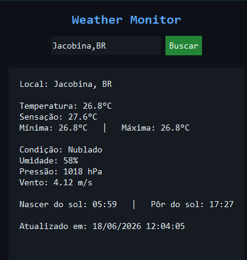

# Weather Monitor

Aplicativo de monitoramento de clima em tempo real, construído em Python com interface gráfica (Tkinter) e dados da API [OpenWeatherMap](https://openweathermap.org/api).



## Funcionalidades

- Busca de clima em tempo real por cidade
- Temperatura atual, sensação térmica, mínima e máxima
- Umidade, pressão atmosférica e velocidade do vento
- Horário de nascer e pôr do sol
- Interface leve em modo escuro

## Pré-requisitos

- Python 3.10+
- Conta gratuita na [OpenWeatherMap](https://openweathermap.org/api) com uma API key

## Instalação

```bash
git clone https://github.com/JoedersonN/weather-monitor.git
cd weather-monitor
pip install -r requirements.txt
```

## Configuração da API Key

A chave da API **nunca** deve ser inserida diretamente no código. Configure-a como variável de ambiente:

**Windows (PowerShell):**
```powershell
$env:OPENWEATHER_API_KEY="sua_chave_aqui"
```

**Windows (CMD):**
```cmd
set OPENWEATHER_API_KEY=sua_chave_aqui
```

**Linux / macOS:**
```bash
export OPENWEATHER_API_KEY="sua_chave_aqui"
```

## Uso

```bash
python weather_app.py
```

Por padrão, o app carrega o clima de Jacobina, BA. Digite outra cidade no campo de busca (formato `Cidade,SiglaPais`, ex: `Salvador,BR`) e pressione Enter ou clique em "Buscar".

## Roadmap

- [ ] Suporte a múltiplas cidades salvas (favoritos)
- [ ] Histórico de buscas
- [ ] Gráfico de variação de temperatura (7 dias)
- [ ] Versão mobile

## Autor

Joederson Neves — [GitHub](https://github.com/JoedersonN) · [LinkedIn](https://linkedin.com/in/joedersonneves)

---

*Projeto desenvolvido para fins de aprendizado e portfólio.*
